# Final Project- Maryland Housing Market 2011-2023

### Members: 
[Brian Keffer](https://github.com/bkeffer3098),
[Ryan Pfefferle](https://github.com/peff22)

## Content

### Selected Topic
An analysis of the Housing Market sales data from 2011-2023.

### Reasons for Topic Selection
As individuals who are or will eventually be looking to own property in Maryland, we found an initial pull to this topic. As we began to explore and analyze this data, we began to see a path to be able to answer different economical questions about where someone may want to purchase property within the state.

### Description of Source Data
Our initial data source is the Maryland Realtors website: https://www.mdrealtor.org/News-and-Events/Housing-Statistics

The monthly housing statistics found there are presented as reported by Bright MLS, which is a multiple listing service (MLS) that offers a centralized platform for real estate professionals to access property listings and related information.

The data is stored in PDF format, so we converted each file into a CSV which enabled us to manipulate the data to create the visualizations and machine learning elements of the project.

The “Units” category represents sales settled in that month. The average sales is the weighted average of sales prices in the county. The average sales is the weighted average of sales prices in the county, calculated by weighting the price of homes by the number of homes sold. The median price is the middle value of the prices of all homes sold in the period—the price at which half the sold homes are above and half are below in selling price.

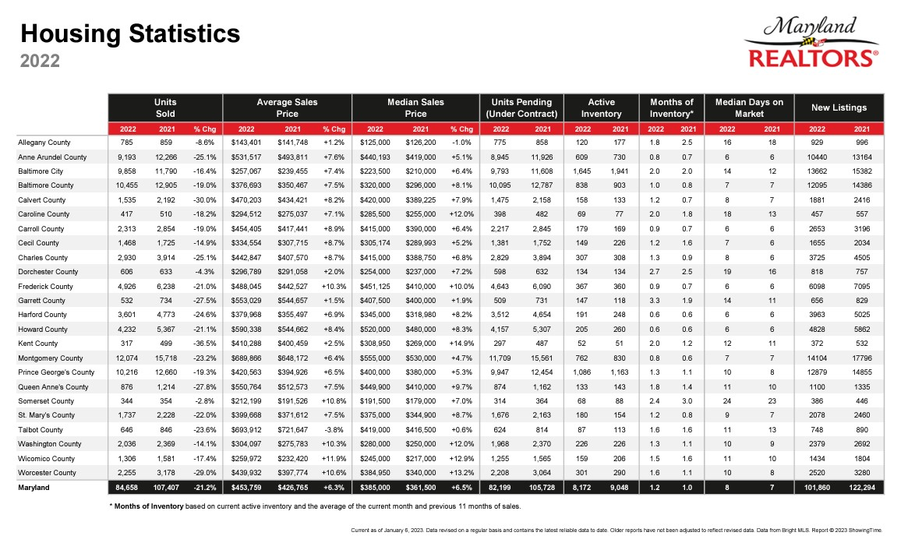

Our secondary source was from the Maryland state website within the Department of Assessments and Taxation: https://dat.maryland.gov/Pages/Sales-Data.aspx

This Sales Data became necessary for this project's success because it offered hundreds more observations for the machine learning models to learn from. This data is broken down into a count of quarterly sales throughout the last decade as well as the median price those units were sold for. 

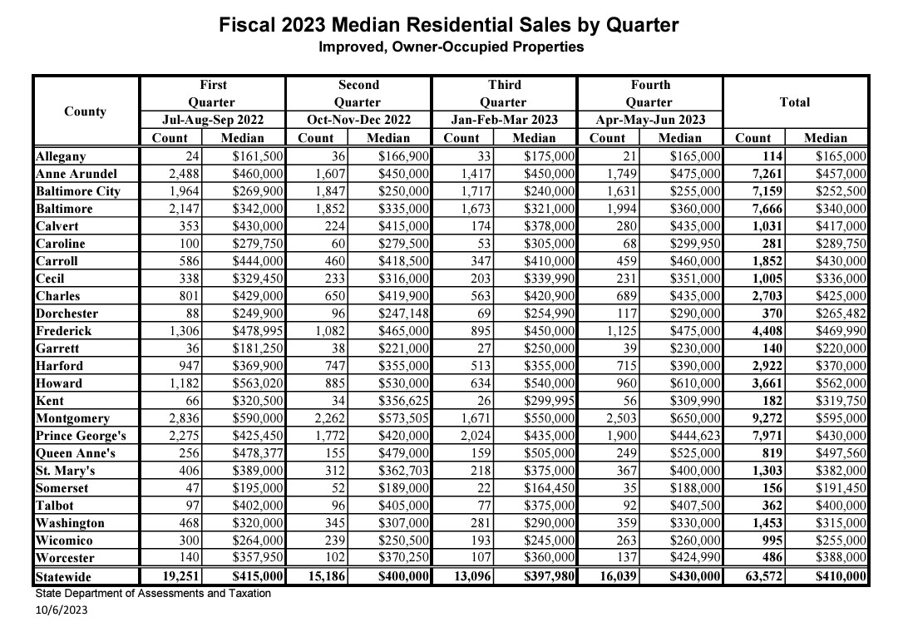

### Analysis Questions

#### Tableau
Over the last 5 years, which Maryland counties have:
1. The lowest average price?
2. Shown the lowest levels of percent increase?
3. Experienced a low or high median number of days on the market? (Low days could indicate higher prices and high days could indicate lower prices)
4. Sold homes at the highest or lowest prices?
5. Sold the highest and lowest number of homes?

#### Supervised Learning
Using a decades worth of Maryland home sales data, can we:
1. Use a Logistic Regression, SVM, or Random Forest model to accurately classify whether prices for 2024 will increase or decrease?
2. Use a Linear Regression and line of best fit to predict the median price of homes?
3. Improve upon the linear regression using encoding and scaling?

## ETL Process (Extract, Transform, Load)

For our initial data, our analysis began by exporting the pdfs we were able to find as excel files. We then cleaned these excel files by deleting rows and columns we deemed unneccesary such as State Totals, Units Pending, Active Inventory, etc. Once cleaned, the manually merged the excel files into one larger dataset to display the county, year, units sold, average price, price % change, median price, median days on the market, and a column from an excel formula initially predicting if the county's price had increased or decreased that year. This dataset was then saved as a CSV for analysis purposes. 

A similar cleaning process was used for our secondary data: unnecessary rows and columns were deleted, the data was merged into one file, and the final dataset displays the county, what quarter of the year, the count of units sold, and the median price. 

# Results of Analysis

## Tableau Visualizations

We utilized Tableau to create visualizations with our main goals being to identify which Maryland counties have the most buyer friendly housing market conditions?

In order to answer this question using Tableau, we first took the source data PDFs, and converted them into CSVs. There is a CSV for each year the data source contained (from 2016 to 2023) but we decided to focus on the data from the past six years as we wanted some recent historical context, but also want information that is current to base our analysis on. Then, we cleaned the CSVs and deleted any columns that we deemed unnecessary for our intended goal.

Next, we connected the CSVs to Tableau and established relationships between them using the “counties” column which is found in each CSV. This enabled us to begin creating worksheets with visualizations. We researched what factors make an area a “buyer friendly” market, and concluded there are five key factors we’re looking for in a county:
Low Average Price
Low Median Price
High Days on Market
Low Price Change Percentage
Low Unit Sales Volume

We created a Tableau worksheet with a visualization for each of these key factors which helped us analyze the counties on a factor by factor basis. This enabled us to see which counties ranked in the top five among each of these key factors on a year by year basis as seen in this example below. We found this information useful especially because it allows us to look at 2023 specifically which gives us an idea of each counties' current housing market while additionally being curious about recent trends. 

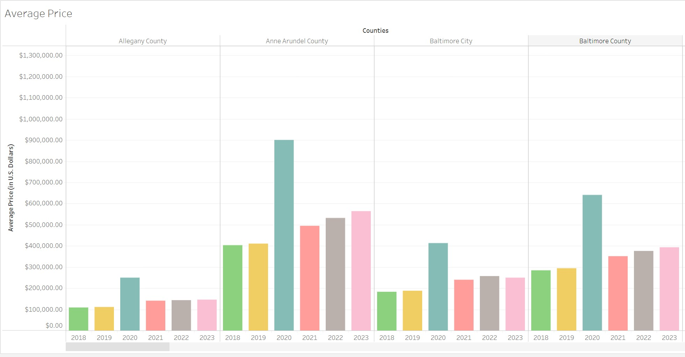

In this unique visualization below, we can gather which counties had high sale prices and low sale prices based on the size of the circles.

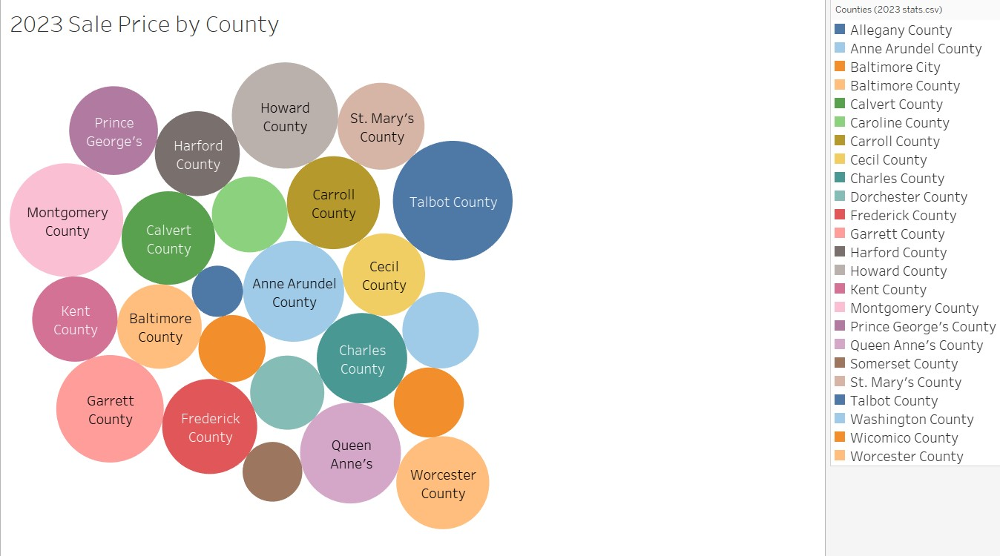

These visualizations were difficult to identify trends with at that stage, so we decided to make a new column called “6 Year Average” to offer more context. To create the “6 Year Average” column found in a few of the visualizations we made a new measure value by creating a calculated field that adds up the sum of each year’s data and divides that number by 6 to give us the six year average. 

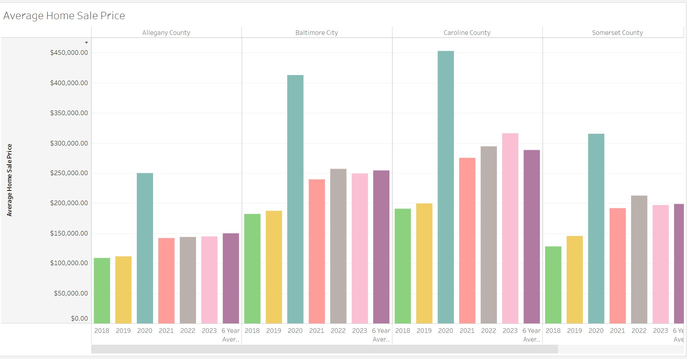

The newly created 6 Year Average not only offers us context, but also allows us to rank each county on its performance in each key factor over the past six years. We decided this was the best way to approach answering our overarching question of which Maryland counties have the most buyer friendly housing market conditions. Using the six year average instead of solely the most recent year’s data (2023) seemed more likely to offer an accurate answer as it factors for the volatility in the housing market of late. Here are the results for top 5 counties by each key factor (and thus the most buyer friendly housing markets over the past six years):

*Images below filter for top 5*

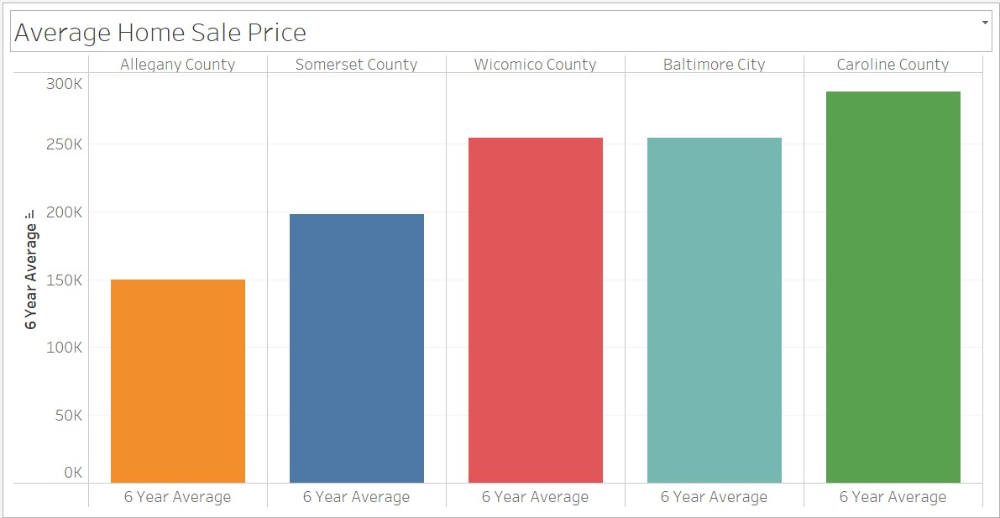
Low Average Price

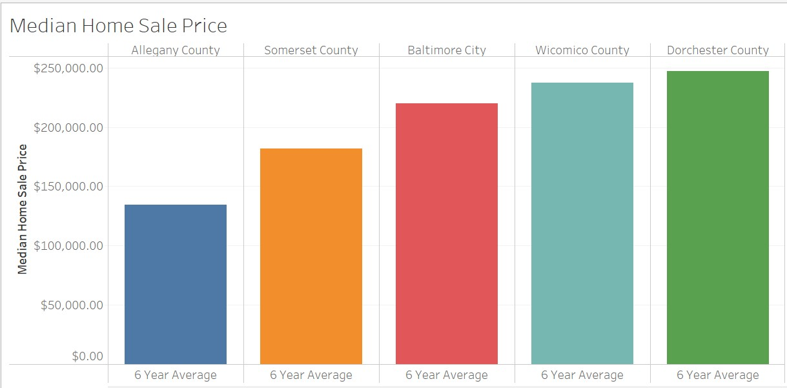
Low Median Price

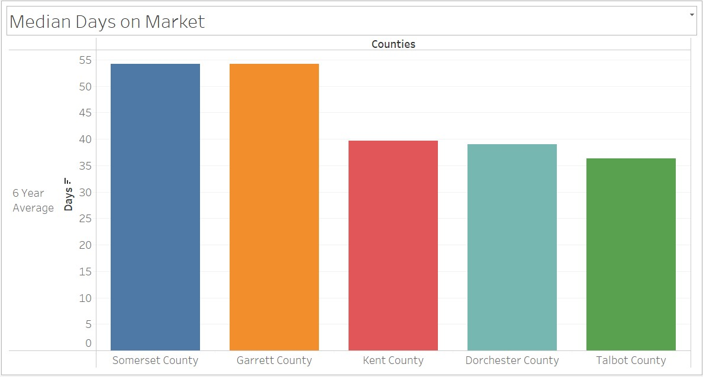
High Days on Market

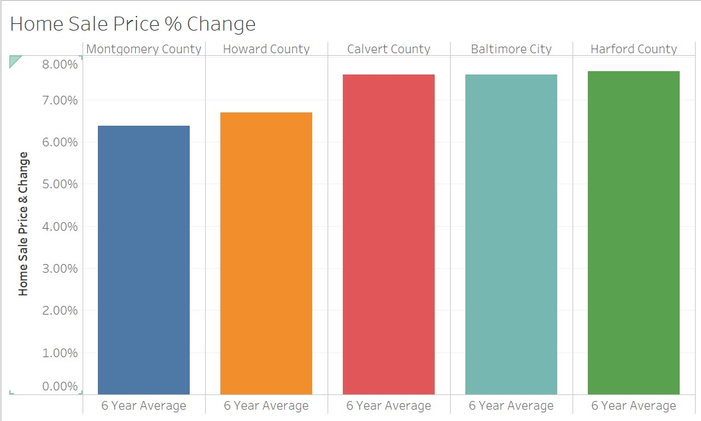
Low Price Change Percentage

Low Unit Sales Volume

## Machine Learning: Supervised

### Initial Models
For this project and the data we analyzed, we centered around supervised learning models due to our targets being labeled and already existing within our datasets. We began by performing a logistic regression to classify for future years whether or not the county would experience a percent increase or decrease in price. 

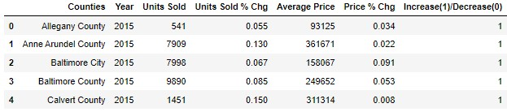

We then proceeded to split our target, Increase of Decrease % Change, from our features, year, units sold, units % change, and average price, to then use a train_test_split. In this way we are using a logistic regression to train the model to be able to accurately classify our testing group as being an increase or decrease year. Next we utilized the confusion matrix upon our training data, testing data, and predicted values to assess how accurately our model was classifying. 

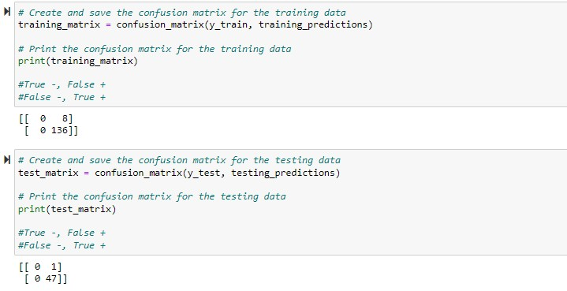

It was here we began to notice our dataset was not as robust as we initially believed as referenced by the number of observations just being shy of 300. We were able to see high accuracy in both the training and testing groups as shown below.

#### Logistic Regression Report
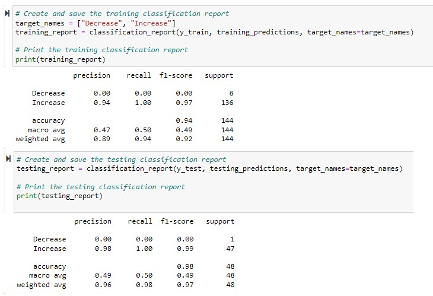 

94% accuracy for the training group and 98% accuracy for the testing group. 

From here we were curious to run two different supervised learning models: SVM and Random Forest. These models performed similarly to the Logistic Regression testing group, producing a 98% accuracy.

#### SVM Model Report
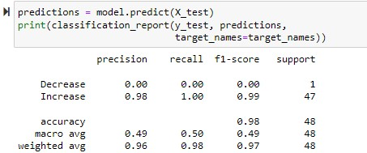

#### Random Forest Model Report
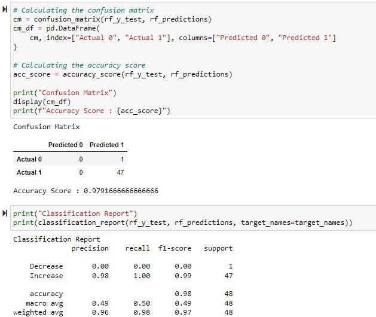

#### Initial Learning Results
While producing a high level of accuracy in being able to correctly classify each year as having an increase in home price or decrease, this dataset leaves much to be desired. The lack of years and counties that experienced a decrease in price was too low to be able to fully trust the models used. A dataset with a higher number of observations would be better suited for this classification. 

### Secondary Model
While not being able to fully trust our previous model's success, in finding additional datasets we were able to more deeply explore the Maryland Housing Market. As we proceed we will be analyzing the new data with a linear regression meant to help predict what the median price for homes may be. 

We begin with a cleaned dataset which includes the County, Quarter, Year, Sale Count, and Median Price of homes in Maryland from 2011-2023. In making the scatterplot below we begin to see a correlation between the Count of homes sold and the Median Prices of those houses. 

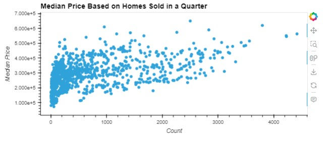

By using a Linear Regression and fitting our independent and dependent variables, we are able to find the line of best fit for this scatterplot and add this line to our visual. 

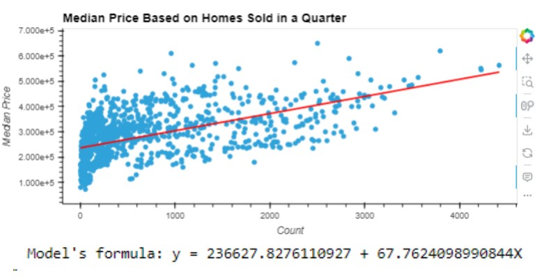

To assess this line's accuracy to our plot we performed an R^2 test to see a score of approximately 0.30, which is not a high enough score to trust moving forward. In seeing this model's performance it becomes clear that we need to include more features in our model as well as scaling and encoding any non-numerical values to potentially see a better performance. 

#### Scaling and Encoding for Better Results
We set our features as Quarter, Year, and Count and our target remains Median Price. Our training data gets set as the values from the dataset before 2021, our validation data is from 2022, and our test data will be set as 2023. We used category_encoders and OneHotEncoder functions as well as a StandardScaler to adjust our dats for any potential outliers, then rerun our R^2 test. The R^2 value at this point is approximately 0.11, which shows a decrease from our initial round of testing. 

#### Secondary Learning Results
Even though we had moved into a different home sales dataset that provided us with a more robust number of observations, we were not able to find the right level of success in trusting our model to be able to predict Median Prices accurately. Outliers within the data could be at fault, or potential inclusion of the counties as a numerical feature could provide better results. 

